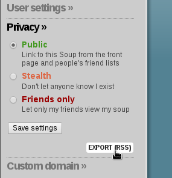

# soublr

Migrate [soup.io][1] posts to [tumblr][2].

    Usage:
      soublr.py <soup_export.rss> <tumblr_credentials.json>
      soublr.py -h | --help
      soublr.py --version

### Installation
Install the python modules in requirements.txt (using [pip][3]):

    pip install -r requirements.txt

### Usage
1. **Export soup.io posts**

    In the soup.io sidebar (the cog icon) select "Privacy", then "Export (RSS)".
    
    

2. **Generate OAuth tokens for tumblr**

    They must be in the format of default_credentials.json.
    Can be created using:

        python generate_credentials.py

3. **Run soublr with credentials and rss export**

        python soublr.py soup_myname_2014-01-01.rss tumblr_credentials.json

  [1]: http://www.soup.io
  [2]: http://www.tumblr.com
  [3]: http://www.pip-installer.org/en/latest/installing.html
